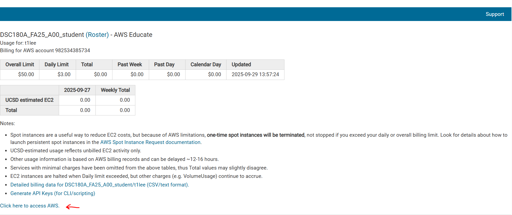
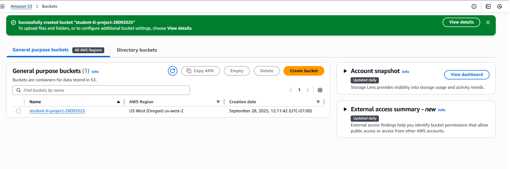
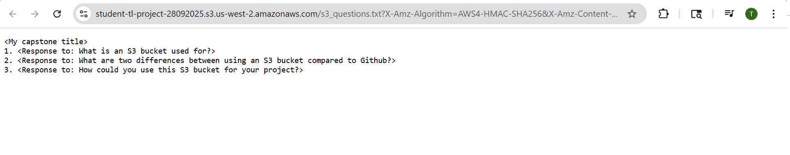
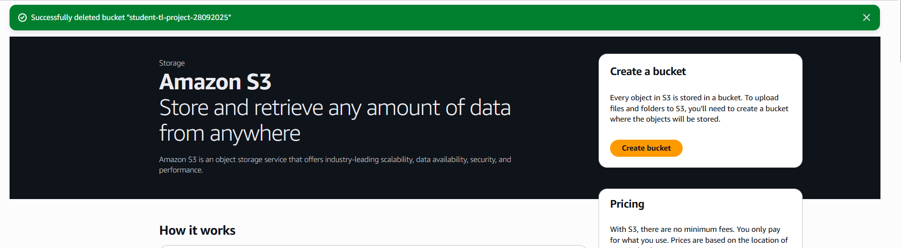
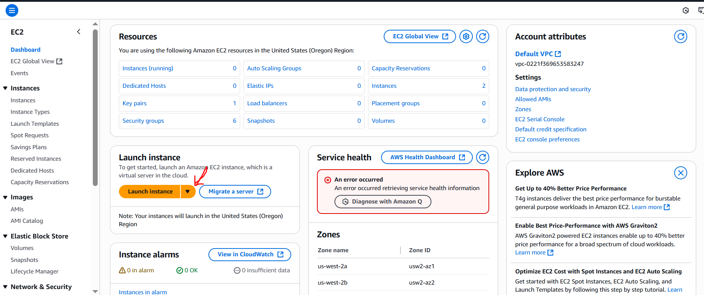
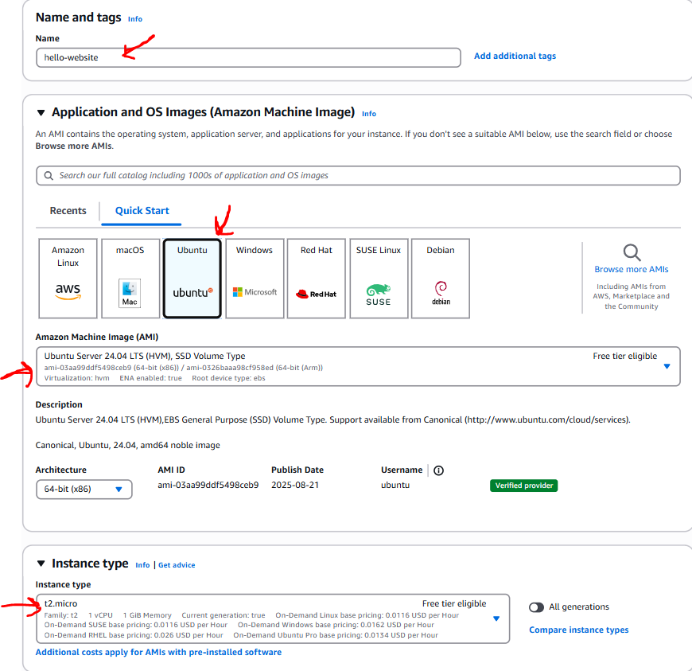
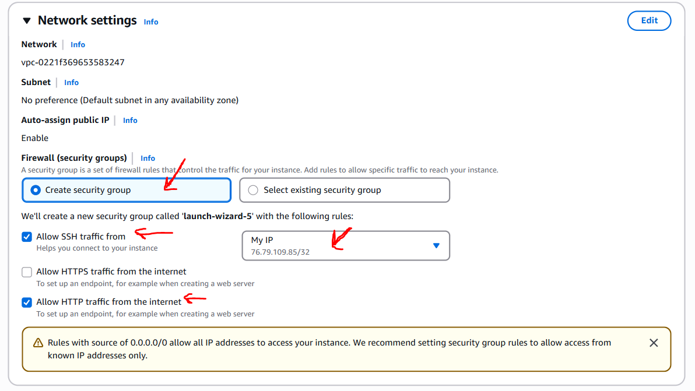
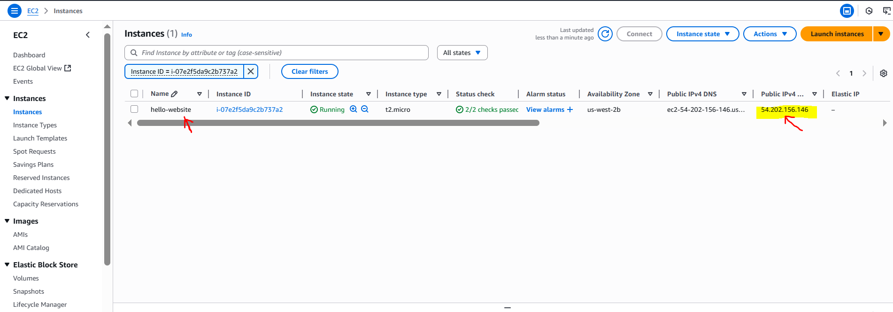
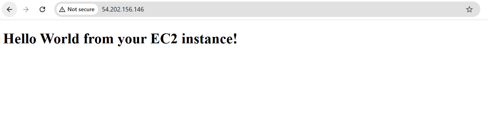

# AWS Fundamentals: S3 and EC2
{:.no_toc}

Learn how to work with AWS cloud services by creating S3 buckets for storage and EC2 instances for computing. Follow the steps carefully and remember to clean up resources to avoid unexpected charges.

**Important**: Always terminate EC2 instances and delete S3 buckets after completing the exercises to avoid charges!
{: .red }

---

## Table of contents
{: .no_toc .text-delta }

1. TOC
{:toc}

---

## Learning Objectives

1.  **AWS S3 bucket creation**
    - Create an AWS S3 bucket for cloud storage
    - Understand how cloud storage works
    - Apply this to future projects

2.  **AWS EC2 instance**
    - Learn how to launch an EC2 instance
    - How to host a simple website on the EC2 instance
    - Importance of terminating instances after use

---

## Launching S3 Bucket

### Part 1: Accessing AWS

1.  Go to: [https://awsed.ucsd.edu/](https://awsed.ucsd.edu/). Login with your credentials if necessary

2.  Select the course: [DSC180A_FA25_A00](https://awsed.ucsd.edu/courses/DSC180A_FA25_A00)

3.  Select "Individual Login Page"

4.  Click "Click here to access AWS" and it should take you to your AWS dashboard

{width="6.5in" height="2.736111111111111in"}

### Part 2: Launch S3 Bucket

In this step, you'll learn how to launch an S3 bucket. The S3 bucket is a cloud-based storage container for storing, securing, and retrieving data from anywhere on the web. It can be used for data storage, hosting static websites, and serving as a data lake.

It can store various types of data including images, videos, audio files, text, and other large binary data. S3 is a foundational service for storing data for various applications, ensuring scalable and secure data storage needs are met.

Follow the steps below on how to launch an S3 bucket:

1.  Search for "S3" in the top search bar and click on it

2.  Next, click the "Create bucket" in orange

3.  Give the bucket name: student-\[your_initials\]-project-\[date\]

    (ie. If my name is Teresa Lee and the date is September 28 2025, the bucket name is "student-tl-project-28092025")

4.  Keep everything else as default and click the "Create bucket" at the end

Once finished creating the bucket, it should look like the following below. You can now store your data in the bucket.

{width="6.5in" height="2.1645833333333333in"}

### Part 3: Test and Apply

1.  Click on your S3 bucket

2.  Create a txt file locally titled "s3_questions.txt"

3.  In this file, write your capstone project title

4.  Under that, answer the following three questions:

    a.  What is an S3 bucket used for?

    b.  What are two differences between using an S3 bucket compared to Github?

    c.  How could you use this S3 bucket for your project?

5.  Upload this file to your bucket

6.  Open this file in your S3 bucket (it should pop up onto a new tab) and you can see the contents

{width="6.5in" height="1.2798611111111111in"}

### Part 4: Clean Up

1.  Delete your test file

2.  Delete your bucket

After deleting your bucket, you can see a confirmation message as below:

{width="6.5in" height="1.7993055555555555in"}

It is good practice to delete AWS resources because cloud resources cost money even when not being used. Professional developers always clean up test environments. And it prevents account clutter and naming conflicts for future projects.

---

## Launching EC2 Instance

### Part 1: Accessing AWS

1.  Go to: [https://awsed.ucsd.edu/](https://awsed.ucsd.edu/). Login with your credentials if necessary

2.  Select the course: [DSC180A_FA25_A00](https://awsed.ucsd.edu/courses/DSC180A_FA25_A00)

3.  Select "Individual Login Page"

4.  Click "Click here to access AWS" and it should take you to your AWS dashboard

{width="6.5in" height="2.736111111111111in"}

### Part 2: Launch EC2 Instance

1.  On the AWS EC2 main page, click the orange "Launch Instance"

{width="6.5in" height="2.736111111111111in"}

2.  Set the following:

    **Name**: hello-website
    
    **AMI**: Ubuntu Server 24.04 LTS
    
    **Instance type**: t2.micro

{width="6.5in" height="6.291666666666667in"}

3.  Choose or create a key pair and download the .pem file

4.  Then in "Network Settings", select "Create security group".

    After, select "Allow SSH traffic from" and choose "My IP" from the dropdown. And select "Allow HTTP traffic from the internet".

{width="6.5in" height="3.6527777777777777in"}

5.  Finally, click "Launch instance" in orange. Then go to your instance dashboard, you will see your instance up and running. The Public IPv4 address is highlighted in yellow below.

{width="6.5in" height="2.263888888888889in"}

### Part 3: Connect via SSH

1.  Open a terminal window (use Gitbash if on Windows)

2.  Run the following commands:

    ```bash
    chmod 400 your-key.pem
    ssh -i your-key.pem ubuntu@<your-ec2-public-ip>
    ```
    
    Replace "your-key.pem" with your file name and `<your-ec2-public-ip>` with the IP address shown in the EC2 console.

3.  Then run the following commands to install Nginx Web Server

    ```bash
    sudo apt update
    sudo apt install nginx -y
    sudo systemctl start nginx
    ```

4.  Edit the default web page with the following commands:

    ```bash
    sudo nano /var/www/html/index.html
    ```

5.  Replace the contents with the following:

    ```html
    <!DOCTYPE html>
    <html>
    <head><title>Hello from EC2</title></head>
    <body>
    <h1>Hello World from your EC2 instance!</h1>
    </body>
    </html>
    ```

    Save and exit (Enter, CTRL+X)

### Part 4: View Website in the Browser

1.  Open a new tab on your computer browser and paste: `http://<your-ec2-public-ip>`

    Replace `<your-ec2-public-ip>` with your public IP address.

2.  You should see your custom "Hello World" web page deployed by your EC2 instance!

{width="6.5in" height="1.1595614610673666in"}

### Part 5: Terminating Instance

- Finally after you are done with this exercise, it's important to terminate the EC2 instance to avoid unexpected charges

- Even if you aren't using it, AWS still charges you as long as the instance is running because storage is still allocated

- Students can request for credits to their AWS educate accounts, but if misused and a student fails to terminate instances, **students will be responsible for the unexpected charges**